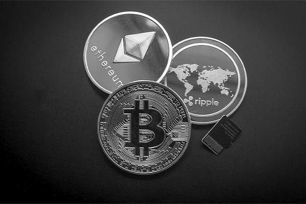

 [![Contributors][contributors-shield]][contributors-url] [![Stargazers][stars-shield]][stars-url] [![Forks][forks-shield]][forks-url] [![Issues][issues-shield]][issues-url] [![MIT License][license-shield]][license-url] [![LinkedIn][linkedin-shield]][linkedin-url]

 

    
    <h3 align="center">Monthly Cryptoasset Market Report & Outlook</h3>

<!--
## About the Project

GOAL: Produce a monthly market report to understand the cryptoasset capital market and outlook. The report will focus on capturing various cryptoassets volatility...

We're interested in producing a monthly market report on the ...
... highlighting cryptoassets ...

- Crypto is volatile (why?)
- In this project, we focus on _____
- project is split into 4 main parts:
    1. financial data processing
    2. processing news articles
    3. exploratory data analysis
    4.

 The following will be reflected for each cryptoasset mentioned above:
    - USD price
    - Volatility
    - Volume (in billions)
    - Close price
    - 1 Mo. return
    - 3 Mo. return
    - 2021 Return
    - Monthly high
    - Monthly low
    - Annualized vol.
    - volume in billions
    - annualized velocity

## Data Processing

Data Sources:
- cryptowat.ch REST API
- NEWS API
 -->

<!-- Links -->

[contributors-shield]: https://img.shields.io/github/contributors/najuzilu/crypto_report.svg?style=flat-square
[contributors-url]: https://github.com/najuzilu/crypto_report/graphs/contributors
[forks-shield]: https://img.shields.io/github/forks/najuzilu/crypto_report.svg?style=flat-square
[forks-url]: https://github.com/najuzilu/crypto_report/network/members
[stars-shield]: https://img.shields.io/github/stars/najuzilu/crypto_report.svg?style=flat-square
[stars-url]: https://github.com/najuzilu/crypto_report/stargazers
[issues-shield]: https://img.shields.io/github/issues/najuzilu/crypto_report.svg?style=flat-square
[issues-url]: https://github.com/najuzilu/crypto_report/issues
[license-shield]: https://img.shields.io/badge/License-MIT-yellow.svg
[license-url]: https://github.com/najuzilu/crypto_report/blob/master/LICENSE
[linkedin-shield]: https://img.shields.io/badge/-LinkedIn-black.svg?style=flat-square&logo=linkedin&colorB=555
[linkedin-url]: https://www.linkedin.com/in/yuna-luzi/
